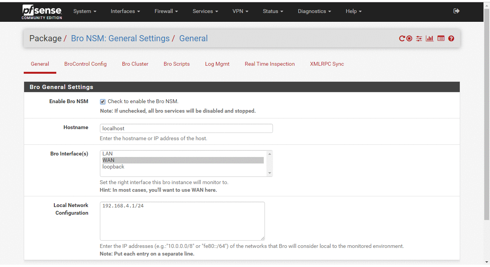

# pfSense-pkg-zeek

Zeek Network Security Monitor package for pfSense router/firewall

<br>



# Compatibility
This package has been tested on **pfSense 2.4.4-RELEASE-p2 (amd64)**. Maybe it might not work with older versions of pfSense.
<br><br>

# Installation

## Download the generated package through [pfSense-pkg-zeek](https://github.com/shadonet/pfSense-pkg-bro/raw/master/data/pfSense-pkg-bro-0.1.0.txz)

## Copy the package from your local machine to your firewall
You’ll need to enable ssh access to your pfSense firewall as it’s not enabled by default. To do this, login to pfsense and browse to **System > Advanced**, then scroll down to the SSH section and check **‘Enable Secure Shell’**.
<br>
By default, pfSense disables upstream pkg repositories (for good reason). So we need to re-enable them albeit, temporarily. There are two files you’ll need to edit.

```shell
/usr/local/etc/pkg/repos/FreeBSD.conf
/usr/local/share/pfSense/pkg/repos/pfSense-repo.conf
```
Make it look like:

```shell
FreeBSD: { enabled: yes }
```
As this package depends on zeek, we need to update the pkg cache and get on with installing zeek.

```shell
pkg update && pkg install -y zeek 
```

Finally, copy the package to your firewall temporary folder.

```shell
scp ~/Downloads/pfSense-pkg-bro-0.1.0.txz root@firewall-ip-address:/tmp/
```
## Install the package on the firewall via pkg add command
```shell
pkg add pfSense-pkg-bro-0.1.0.txz
```
Now, you can access the interface by login to pfSense and browse to **Services > Zeek NSM**

## Contribution
- **Having an issue**? or looking for support? [Open an issue](https://github.com/shadonet/pfSense-pkg-bro/issues/new) and we will get you the help you need.
- Got a **new feature or a bug fix**? Fork the repo, make your changes, and submit a pull request.

## Support this project
If you find this project useful, please star the repo to let people know that it's reliable. Also, share it with friends and colleagues that might find this useful as well. Thank you :smile:

# License (Apache 2.0)

 Copyright (c) 2019 Prosper Doko
 All rights reserved.

 Licensed under the Apache License, Version 2.0 (the "License");
 you may not use this file except in compliance with the License.
 You may obtain a copy of the License at

 http://www.apache.org/licenses/LICENSE-2.0

 Unless required by applicable law or agreed to in writing, software
 distributed under the License is distributed on an "AS IS" BASIS,
 WITHOUT WARRANTIES OR CONDITIONS OF ANY KIND, either express or implied.
 See the License for the specific language governing permissions and
 limitations under the License.
